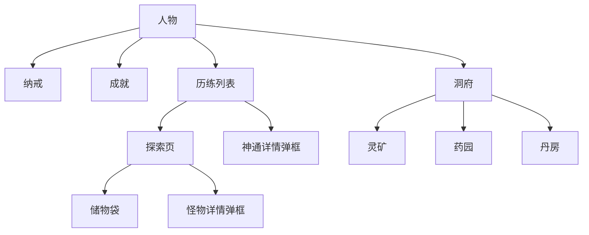
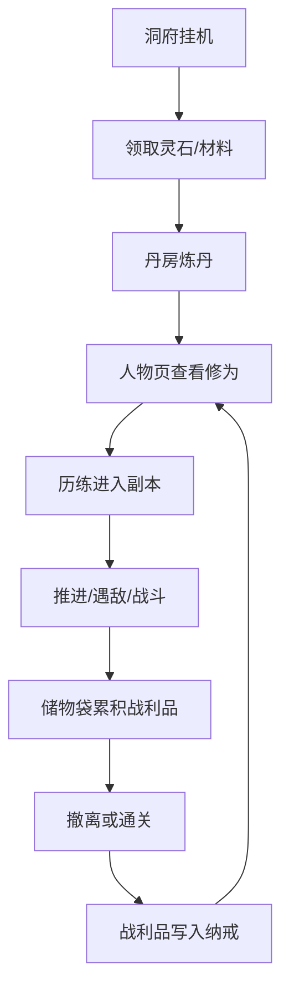
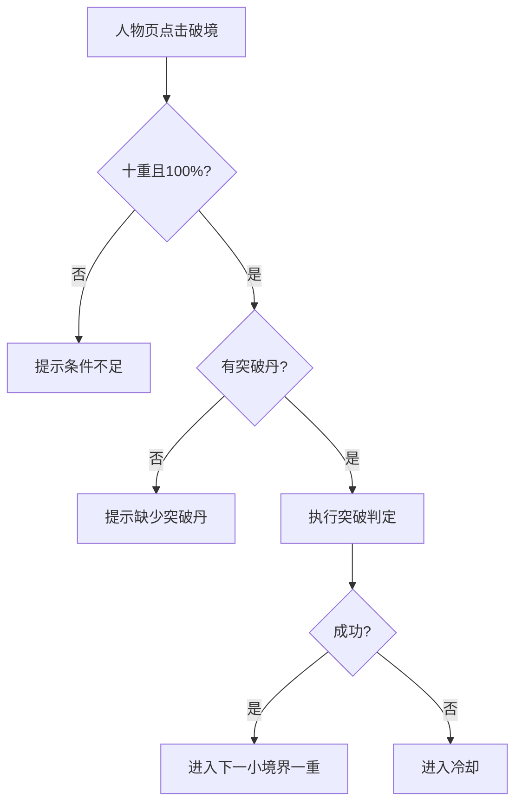

# 修仙版地下城堡 · UI/UE 规格稿

版本：v0.9.7
日期：2026-03-18
对应 PRD：[prd_current.md](/Users/cuihua/Documents/git/minigame-1/product/prd_current.md)
用途：用于 UI 绘制、前端实现、交互联调、测试验收

## 1. 输出范围
本文件输出以下内容：
- 页面结构图
- 交互流转图
- 页面状态说明
- 点击反馈与弹框规则
- 主要页面低保真效果稿

## 2. 全局设计约束
### 2.1 画布与布局
- 目标设备比例：手机竖屏
- 主内容区采用单列布局
- 页面上中下结构固定：
  - 顶部：标题 / 境界 / 导航
  - 中部：核心内容区
  - 底部：主导航或操作按钮

### 2.1.1 页面分区比例
以页面可用高度 `H` 为基准：

| 页面 | 顶部区 | 中部区 | 底部区 |
| --- | --- | --- | --- |
| 人物 | 24% | 52% | 24% |
| 历练列表 | 18% | 70% | 12% |
| 探索未遇敌 | 14% | 50% | 36% |
| 探索遇敌 | 20% | 44% | 36% |
| 洞府 | 20% | 64% | 16% |
| 纳戒 | 12% | 88% | 0% |
| 成就 | 12% | 88% | 0% |

### 2.2 组件规则
- 按钮：
  - 高度统一
  - 文本居中
  - 禁用态置灰
- 卡格：
  - 统一描边
  - 统一内边距
  - 统一点击区域
- 弹框：
  - 点击空白关闭
  - 内容居中
  - 不展示冗余说明

### 2.3 显示规则
- 0 数量内容不展示
- 未遭遇敌人不展示敌方区
- 未发生技能释放不展示 CD 区
- 外层不展示攻击/防御/神识
- 储物袋为独立页面，不作为探索页内弹框展示

### 2.4 基础尺寸
- 页面左右安全边距：16 px
- 最小点击高度：44 px
- 顶部标题区建议高度：48 px
- 底部按钮区建议高度：52 px
- 神通 / 技能卡格最小高度：52 px
- 弹框最小宽度：220 px
- 血条最小高度：10 px
- 列表卡片最小高度：40 px
- 顶部标题与副标题垂直间距：8 px

### 2.5 空间压缩优先级
当空间不足时，页面压缩顺序统一如下：
1. 压缩说明性留白
2. 压缩中部提示区
3. 压缩卡格间距
4. 启用内部滚动区

禁止压缩：
- 顶部安全区
- 血条高度
- 按钮点击高度
- 左右安全边距

### 2.6 热区与信息优先级
- 关卡行整行可点
- 神通格 / 技能格整格可点
- 境界切换按钮点击区按可见框外扩 4 px 计算
- 返回箭头点击区不得小于 44 px 高
- 血条热区仅承担详情或说明入口，不可与底部按钮区重叠
- 当空间不足时，信息让位顺序为：
  1. 说明性文案
  2. 中部留白
  3. 卡格间距
  4. 中部内部滚动

## 3. 页面关系图


## 4. 主导航交互
### 4.1 主导航页
- 人物
- 历练
- 洞府

### 4.2 隐藏主导航页
- 纳戒
- 成就
- 储物袋

### 4.3 返回规则
- 纳戒、成就、储物袋左上角显示返回箭头
- 返回目标：
  - 纳戒 -> 人物
  - 成就 -> 人物
  - 储物袋 -> 探索

### 4.4 页面状态总表
| 页面 | 常态 | 空态 | 弹框态 | 隐藏主导航 |
| --- | --- | --- | --- | --- |
| 人物 | 是 | 否 | 属性说明 | 否 |
| 历练列表 | 是 | 否 | 神通详情 | 否 |
| 探索 | 是 | 是 | 怪物详情 | 否 |
| 储物袋 | 是 | 是 | 否 | 是 |
| 洞府 | 是 | 是 | 否 | 否 |
| 纳戒 | 是 | 是 | 否 | 是 |
| 成就 | 是 | 是 | 奖励弹框 | 是 |

## 5. 人物页
### 5.1 布局图
```text
┌──────────────────────┐
│       角色名称        │
│       角色题句        │
│----------------------│
│      炼气初期一重     │
│ 修为：一重 40% · 10分 │
│                      │
│ [气血标签]     [316] │
│ [煞气标签]       [0] │
│                      │
│       —— 装备 ——      │
│ 兵器            无    │
│ 法衣            无    │
│ 戒指            无    │
│                      │
│ [纳戒]        [成就]  │
│        [破境]         │
└──────────────────────┘
```

### 5.2 交互规则
- 点击 `气血` / `煞气` 标签：打开说明弹框
- 点击 `纳戒`：进入纳戒页
- 点击 `成就`：进入成就页
- 点击 `破境`：
  - 条件不足：提示原因
  - 条件满足：触发突破逻辑

### 5.3 弹框规则
- 属性说明弹框仅显示说明正文
- 文案居中
- 无标题占位

## 6. 历练列表页
### 6.1 布局图
```text
┌──────────────────────┐
│       ——历练关卡——    │
│ [上一境]  [炼气] [下一境]│
│                      │
│ 初期·野狼谷外围  点击探索│
│ 中期·野狼谷中心    未解锁│
│ 后期·野狼谷深处    未解锁│
│----------------------│
│        ——神通——       │
│ [装配1][装配2][装配3] │
│ [装配4][装配5][装配6] │
│                      │
│ [归元指][清心诀][空位] │
│ [......可滚动......]  │
└──────────────────────┘
```

### 6.2 交互规则
- 点击 `上一境` / `下一境`：切换当前关卡组
- 点击关卡行：进入探索
- 点击神通标题：打开“释放顺序说明”弹框
- 点击神通格：
  - 已装配：查看详情，可移除
  - 未装配：查看详情，可装配
- 点击上下区域：滚动神通列表

### 6.3 神通格规范
- 格内仅显示：
  - 名称
  - 等级名
- 不显示：
  - 碎片
  - 倍率
  - 冗长描述

### 6.4 神通区状态
| 状态 | 展示 |
| --- | --- |
| 装配槽空 | 显示空位 |
| 神通已装配 | 显示名称 + 等级名 |
| 神通可查看未装配 | 显示名称 + 等级名 |
| 神通列表超出高度 | 允许滚动 |

### 6.5 历练页布局规则
- 装配槽区固定两行三列
- 神通列表区独立滚动
- 神通标题行与装配槽区之间保持固定分隔
- 关卡列表区和神通区不允许互相挤占
- 境界切换后，神通列表滚动位置重置到顶部

## 7. 探索页
### 7.1 常态布局
```text
┌──────────────────────┐
│     【野狼谷外围】     │
│        层数 3/10      │
│                      │
│    短时文本提示区      │
│                      │
│                      │
│      人物信息区        │
│   [==========259]     │
│        煞气 0         │
│                      │
│ [自动推进] [探索] [储物袋]│
└──────────────────────┘
```

### 7.2 遇敌布局
```text
┌──────────────────────┐
│     【野狼谷外围】     │
│        层数 5/10      │
│     炼气·首领         │
│   [========600]       │
│                      │
│      战斗舞台区        │
│   （场景文案/敌影）    │
│                      │
│        我方 281       │
│    [========281]      │
│        煞气 0         │
│ [撤离] [战斗] [储物袋] │
│ [归元指][清心诀][空位] │
│ [破甲掌][怒击][震魂]   │
└──────────────────────┘
```

### 7.3 交互规则
- 点击敌方血条：打开怪物详情弹框
- 点击储物袋：进入储物袋页
- 点击自动推进：切换自动推进状态
- 点击探索：推进一层
- 点击战斗：开始即时战斗
- 点击撤离：进入撤离确认流程

### 7.4 短时文本提示规则
- 居中显示
- 用于表现推进、拾取、陷阱、遭遇
- 持续若干秒后自动消失
- 玩家继续推进后强制刷新为新文本

### 7.5 CD 区规则
- 神通区固定在底部操作区下方
- 未进入战斗时仅显示神通名称卡格
- 进入战斗后显示 CD 条
- 每个技能用独立卡格表示
- 卡格只显示：
  - 技能名称
  - CD 条

### 7.6 探索页状态表
| 状态 | 顶部区 | 中部区 | 底部区 |
| --- | --- | --- | --- |
| 未遇敌 | 关卡名 + 层数 | 短时文本或空白 | 我方信息 + 自动/探索/储物袋 |
| 遇敌待战 | 关卡名 + 层数 + 敌方血条 | 战斗舞台区 | 我方信息 + 撤离/战斗/储物袋 + 神通格 |
| 战斗中 | 关卡名 + 层数 + 敌方血条 | 战斗舞台区 | 我方信息 + 底部按钮 + 神通格 |
| 死亡态 | 关卡名 + 层数 | 空白 | 广告复活/认命离开/储物袋 |

### 7.7 探索页布局约束
- 顶部标题区必须完整容纳：
  - 关卡名
  - 层数
  - 敌方血条（遇敌态）
- 中部战斗舞台区优先承载场景文案与敌方视觉主体
- 底部人物信息区必须完整容纳：
  - 人物气血条
  - 煞气
  - 3 个底部按钮
  - 2 行 3 列神通格
- 不显示“点击上方血条查看怪物详情”类辅助文案

### 7.8 探索页滚动与显隐
- 探索页主画布不滚动
- 仅技能区允许内部压缩显示
- 短时文本出现时，技能区可暂时隐藏
- 储物袋页为独立页面，不在探索页内展开

## 8. 怪物详情弹框
### 8.1 布局图
```text
┌──────────────────┐
│    炼气·首领     │
│    气血 600      │
│    煞气 10       │
│                  │
│      怪物技能     │
│ 破甲｜伤害140｜CD2.8│
│ 怒击｜伤害105｜CD3.2│
└──────────────────┘
```

### 8.2 规则
- 不显示气息
- 不显示攻击/防御/神识
- 不显示技能增益描述

## 9. 储物袋页
### 9.1 布局图
```text
┌──────────────────────┐
│ <-      储物袋        │
│----------------------│
│ 回灵丹          数量1 │
│ 传送符          数量1 │
│ 灵石             本层50│
│ 灵草            数量1 │
│ 玄冰精          数量1 │
└──────────────────────┘
```

### 9.2 规则
- 0 数量物品不显示
- 点击回灵丹：立即使用
- 点击传送符：立即撤离并结算
- 点击其它条目：不触发使用

## 10. 洞府页
### 10.1 总布局
```text
┌──────────────────────┐
│     洞府·1阶  [升级]  │
│ 修为+100/h 灵石+50/h │
│ [灵矿] [药园] [丹房] │
│----------------------│
│      子页内容区       │
│                      │
│                      │
│----------------------│
│    [领取洞府产出]     │
└──────────────────────┘
```

### 10.2 灵矿子页
- 显示：
  - 总灵仆
  - 已分配
  - 灵矿人数
  - 当前灵石产速
  - 待领取灵石
- 操作：
  - `+`
  - `-`

### 10.3 药园子页
- 显示：
  - 总灵仆
  - 已分配
  - 药园人数
  - 基础材料产速
  - 稀有材料产速
  - 已解锁种子
  - 纳戒库存（仅显示大于 0）

### 10.4 丹房子页
- 每个丹方一张行卡
- 行内结构：
  - 丹名
  - 材料
  - 操作按钮
- 按钮状态：
  - 可炼制：高亮
  - 材料不足：置灰
  - 未解锁：置灰

### 10.5 洞府页状态表
| 子页 | 常规状态 | 空态 |
| --- | --- | --- |
| 灵矿 | 显示调度、产速、待领取 | 待领取为 0 |
| 药园 | 显示调度、产速、种子、库存 | 库存无材料 |
| 丹房 | 显示丹方列表或炼制进度 | 无可炼丹方 |

### 10.6 洞府页空间规则
- 顶部洞府等级与产能概览固定
- 页签区固定
- 子页内容区独立承载滚动
- 底部“领取洞府产出”固定，不随内容滚动

## 11. 纳戒页
### 11.1 规则
- 左上角返回
- 不显示主导航
- 列表式展示库存
- 0 数量不展示
- 可使用的丹药和装备可点击

## 12. 成就页
### 12.1 规则
- 左上角返回
- 不显示主导航
- 纵向滚动
- 默认不直接显示奖励数值
- 点击成就条目打开奖励弹框

### 12.2 成就条目结构
- 成就名
- 当前进度 / 目标值
- 进度条
- 已领取 / 未领取状态

## 13. 关键交互流
### 13.1 主流程


### 13.2 突破交互流


## 14. 交互反馈规范
- 按钮点击：立即高亮反馈
- 禁用按钮：点击无动作，可提示原因
- 弹框：淡入显示
- 受击：血条抖动 + 拖尾
- 探索提示：短时文本替换

### 14.1 反馈时序
- 点击反馈：0~100ms 内出现
- 弹框打开：200ms 内完成
- 短时文本：出现后停留，再自动消失
- 受击反馈：与血条变化同步

### 14.2 战斗反馈时序
- 伤害结算帧：更新血条数字
- 受击帧：触发抖动与拖尾
- 冷却帧：更新 CD 条
- 战斗结束帧：隐藏 CD 区，保留结算后敌我信息

## 15. UI 产出要求
UI 绘制需至少输出：
- 人物页
- 历练列表页
- 探索页常态
- 探索页遇敌态
- 怪物详情弹框
- 储物袋页
- 洞府三子页
- 纳戒页
- 成就页

## 16. 前端实现要求
前端实现需按以下优先级落地：
1. 页面框架与区块位置
2. 状态切换与显隐逻辑
3. 点击热区与跳转关系
4. 卡格、按钮、弹框统一组件化
5. 动效与反馈补充

## 17. UI 交付清单
UI 需交付：
- 页面静态稿
- 弹框稿
- 空态稿
- 禁用态稿
- 战斗态稿
- 资源标注稿（字号、边距、颜色、状态）

## 18. 空间利用验收口径
- 页面主信息区占比必须高于说明性留白
- 同屏不出现三个以上低优先级信息区同时可见
- 探索页顶部、中部、底部三分区必须稳定
- 历练页装配槽与神通列表必须分区明确
- 洞府页顶部概览、子页内容、底部领取区必须层级清楚
