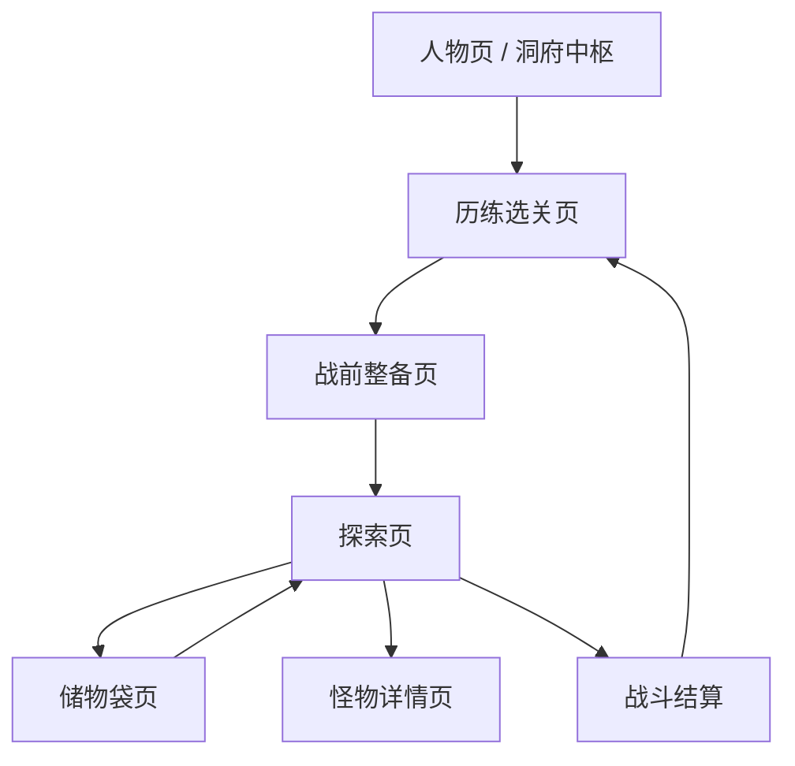

# 历练主链实现级方案

版本：v0.1.0  
日期：2026-03-19  
最近更新：2026-03-19 11:10:00  
文档状态：实现级交互方案  
适用对象：产品、程序、测试、运行态验收

## 1. 文档目的

本文档只解决一件事：把当前版本“历练 -> 战前整备 -> 探索 -> 战斗 -> 结算”这条主链收成无歧义实现方案。

本文档优先级：
- 高于旧的历练交互描述
- 低于 `当前产品需求.md` 的世界观与全局规则
- 若与当前代码实现冲突，以本文档为后续实现目标

## 2. 设计结论

当前版本历练主链采用：

- `地下城堡式双页结构`

即：

1. `历练选关页`
- 只负责告诉玩家“现在该去哪一关”
- 不承担神通管理主职责

2. `战前整备页`
- 只负责调整 3 个神通顺序
- 不承担选关主职责

3. `探索页`
- 只负责行进、遇敌、战斗、结算
- 不承担战前配装主职责

这条结构的核心目标是：
- 主决策拆开
- 页面职责单一
- 每一步都有明确“下一步”
- 其他线程实现时不再自由拼接页面功能

## 3. 页面结构总览

## 4. 页面职责定义

### 4.1 历练选关页

唯一职责：
- 展示当前境界对应的 3 个副本
- 告诉玩家当前主推关卡
- 作为进入战前整备与探索的入口页

禁止承担：
- 直接在主界面大面积管理神通
- 展示过多神通收藏信息
- 直接承担完整储物袋与结算信息

### 4.2 战前整备页

唯一职责：
- 调整 3 个已解锁神通的装配顺序
- 查看神通详情

禁止承担：
- 关卡选择
- 探索状态展示
- 储物袋结算

### 4.3 探索页

唯一职责：
- 行进
- 遭遇
- 战斗
- 结算

禁止承担：
- 神通长期管理
- 境界切换
- 复杂成长说明

## 5. 历练选关页实现规范

### 5.1 页面信息层级

从上到下固定为：

1. 页面标题区
- 标题：`历练关卡`
- 副标题：当前大境界，如 `【炼气】`

2. 境界切换区
- `上一境`
- 当前大境界文本
- `下一境`

3. 当前进度摘要区
- 当前小境界：如 `炼气中期`
- 当前修为经验：如 `1439 / 1798`
- 当前主推：如 `野狼谷深处`
- 若满足突破条件：显示 `可突破`

4. 关卡列表区
- 当前大境界固定 3 条关卡
- 顺序固定为：`初期 / 中期 / 后期`

5. 页面底部行动区
- 左：`战前整备`
- 右：`进入主推`

### 5.2 关卡列表每行结构

每行必须包含：
- 阶段名：`初期 / 中期 / 后期`
- 关卡名
- 状态标签
- 右侧 CTA 文案

状态标签只有以下 4 种：
- `主推`
- `已通关`
- `进行中`
- `未解锁`

右侧 CTA 只有以下 3 种：
- `点击探索`
- `继续探索`
- `未解锁`

### 5.3 主推规则

主推关卡判定规则：

1. 优先当前小境界对应关卡
2. 若该关已通关且经验已满，主推切到下一小境界关卡
3. 若满足突破条件但未突破，主推改为 `返回人物破境`

### 5.4 点击规则

1. 点击已解锁关卡整行
- 进入该关对应的探索页
- 若尚未做战前整备，不阻止进入

2. 点击未解锁关卡整行
- 不进入探索
- 仅提示：
  - 当前解锁条件
  - 建议主推关卡

3. 点击 `战前整备`
- 进入战前整备页
- 默认保留当前大境界与当前主推关卡上下文

4. 点击 `进入主推`
- 直接进入当前主推关卡探索页

### 5.5 视觉优先级

必须满足：
- 关卡列表区面积大于页面一半
- 关卡列表视觉权重大于神通相关元素
- 页面首屏必须一眼看出“下一步去哪一关”

禁止出现：
- 关卡列表被神通卡挤压到次要位置
- 首屏出现 3 张以上神通卡
- 需要弹框解释“为什么推荐这一关”

## 6. 战前整备页实现规范

### 6.1 页面目标

战前整备页只解决一个决策：
- `3 个神通按什么顺序释放`

### 6.2 页面结构

从上到下固定为：

1. 返回区
- 左上返回箭头
- 返回历练选关页

2. 标题区
- 标题：`战前整备`
- 副标题：当前大境界与主推关卡

3. 当前装配区
- 固定 1 行 3 列
- 标题：`出手顺序`
- 每槽显示：
  - 顺位编号 `1 / 2 / 3`
  - 神通名或 `空位`

4. 可选神通区
- 仅展示当前已解锁神通
- 当前版本最多只会是 1~3 张
- 不再展示更高境界的未解锁收藏卡

5. 神通详情区
- 不做默认常驻
- 点击神通卡后才弹出详情

### 6.3 当前版本神通数量规则

当前正式规则：
- 每个大境界仅有 1 个神通
- 玩家当前最多可使用：
  - 当前大境界神通
  - 低一境界神通
  - 低两境界神通
- 最多装配 3 个神通

### 6.4 推荐交互方案

当前唯一推荐交互：

1. 点击某个装配槽
- 槽位进入选中态
- 页面底部提示：`请选择要放入第 X 位的神通`

2. 点击某个可选神通卡
- 若该神通未装配：直接放入当前选中槽
- 若该神通已装配在其它槽：直接交换顺位

3. 点击已装配槽位中的神通
- 弹出详情
- 详情内提供：
  - `查看详情`
  - `移出该位`

4. 当场上仅剩 1 个已装配神通时
- `移出该位` 置灰

### 6.5 明确禁止的交互

禁止：
- 在历练选关页主屏直接完成完整装配流程
- 用长说明弹框解释顺位规则
- 用“点上半区/下半区”模拟滚动
- 装配时必须二次确认
- 因神通已装配在别处而报错中断

### 6.6 神通详情弹框字段

只允许显示：
- 境界 + 神通名
- 当前等级名
- 伤害
- 特殊效果（仅当存在回复气血时显示）
- 当前 CD

禁止显示：
- 旧碎片字段
- 旧倍率字段
- 已删除的复杂加成描述

## 7. 探索页实现规范

### 7.1 页面状态机

探索页固定分为 5 个状态：

1. `关卡初始`
- 进入关卡后显示
- 尚未推进

2. `行进中`
- 玩家点击探索或自动推进后
- 出现短时提示文本或事件文本

3. `遇敌待战`
- 遇到敌人
- 玩家尚未点击战斗

4. `战斗中`
- 双方按 CD 自动结算

5. `结算完成`
- 通关
- 或成功撤离
- 或死亡后认命离开

### 7.2 页面结构

从上到下固定为：

1. 顶部战区信息
- 关卡名
- 当前层数
- 遇敌时显示敌人名称与敌方血条

2. 中部舞台区
- 未遇敌：短时提示文本或空白
- 遇敌/战斗中：敌方立绘占位或舞台区

3. 底部我方操作区
- 我方血条
- 状态按钮行或战斗神通格

### 7.3 各状态显隐规则

#### 7.3.1 关卡初始

显示：
- 关卡名
- 层数 `0/总层数`
- 我方血条
- 按钮：`自动推进 / 探索 / 储物袋`

隐藏：
- 敌方血条
- 神通 CD 条
- 战斗按钮

#### 7.3.2 行进中

显示：
- 顶部关卡信息
- 中部短时提示文本
- 我方血条
- 按钮：`自动推进 / 探索 / 储物袋`

隐藏：
- 敌方详情
- 战斗神通格

#### 7.3.3 遇敌待战

显示：
- 顶部敌人名称 + 敌方血条
- 中部敌方舞台
- 我方血条
- 按钮：`撤离 / 战斗 / 储物袋`
- 1 行 3 列神通格（只显示名称，不显示 CD 动态）

隐藏：
- 探索按钮
- 自动推进按钮

#### 7.3.4 战斗中

显示：
- 顶部敌方血条
- 中部战斗舞台
- 我方血条
- 1 行 3 列神通格
- 神通 CD 条

隐藏：
- `撤离`
- `战斗`
- `储物袋`

#### 7.3.5 结算完成

通关 / 撤离成功：
- 显示结算信息
- 显示返回历练按钮

死亡待确认：
- 显示：
  - `广告复活`
  - `认命离开`
  - `储物袋`

### 7.4 储物袋与纳戒规则

当前正式规则：

1. 探索掉落先进入 `runBag`
2. `runBag` 分为：
- 随身物资
- 本次战利品

3. 成功撤离或通关时：
- `runBag` 中战利品写入永久 `inventory`

4. 死亡认命离开时：
- `runBag` 中本次战利品全部丢失

5. 突破丹只允许从永久 `inventory` 消耗

### 7.5 探索页明确禁止事项

禁止：
- 在战斗中继续显示 `撤离 / 战斗 / 储物袋`
- 把储物袋做成探索页底部展开框
- 在探索页展示永久纳戒全部库存
- 在探索页展示已废弃的煞气
- 用战斗日志刷屏替代战斗反馈

## 8. 数据读取规范

### 8.1 历练选关页必须读取

- 当前人物大境界
- 当前人物小境界
- 当前经验值
- 当前突破条件
- 当前 3 关关卡配置
- 当前关卡通关状态

### 8.2 战前整备页必须读取

- 当前已解锁神通列表
- 当前 3 槽装配顺序
- 每个神通的：
  - 名称
  - 境界
  - 当前等级名
  - 伤害
  - CD
  - 特殊效果

### 8.3 探索页必须读取

- 当前关卡脚本
- 当前层数
- 当前敌人模板
- 当前 `runBag`
- 当前永久 `inventory`
- 当前人物气血、经验、突破状态

## 9. 实现约束

### 9.1 对实现线程的硬约束

必须：
- 让历练选关页与战前整备页成为两个明确入口
- 让运行时敌人读取正式真源
- 让探索页严格遵守状态显隐规则

禁止：
- 为了省事继续把所有流程堆回一个页面
- 用旧神通收集页逻辑伪装战前整备页
- 继续公式造怪并只改表格文案

### 9.2 对测试线程的硬约束

涉及交互改动时，必须在微信开发者工具验证以下 6 条：

1. 历练页打开后能一眼看到主推关卡
2. 战前整备页能在 3 次点击内完成一次顺位调整
3. 未遇敌状态只出现 `自动推进 / 探索 / 储物袋`
4. 遇敌待战状态只出现 `撤离 / 战斗 / 储物袋`
5. 战斗中不再出现底部按钮行
6. 成功撤离与死亡离开的战利品写入结果不同

## 10. 运行态 Smoke Case

### 10.1 Case A：主推关卡进入

步骤：
1. 进入历练页
2. 确认主推关卡有明显标识
3. 点击 `进入主推`
4. 成功进入探索页

通过标准：
- 无额外弹框阻断
- 进入的是主推副本而不是错误关卡

### 10.2 Case B：顺位替换

步骤：
1. 进入战前整备页
2. 点击第 2 位槽
3. 点击另一个可选神通
4. 返回历练页

通过标准：
- 顺位变化立即生效
- 无多余确认弹框
- 返回历练后保持新顺位

### 10.3 Case C：掉落 -> 储物袋 -> 成功撤离

步骤：
1. 进入探索页
2. 击败一名敌人获得掉落
3. 打开储物袋确认本次战利品存在
4. 撤离成功
5. 打开纳戒确认写入

通过标准：
- 战利品先在储物袋，不提前写入纳戒
- 成功撤离后才进入纳戒

### 10.4 Case D：掉落 -> 储物袋 -> 死亡离开

步骤：
1. 进入探索页
2. 击败敌人获得掉落
3. 确认储物袋中已有战利品
4. 死亡后选择认命离开
5. 返回人物/纳戒检查

通过标准：
- 本次战利品丢失
- 永久纳戒库存不增加

## 11. 当前版本的明确不做

当前版本不做：
- 神通收藏展示页
- 洞府生产链
- 挂机修为
- 煞气系统
- 旧十重成长
- 探索页长篇战斗日志

## 12. 下个文档建议

本方案落地后，下一份应补：

1. `探索与战斗实现级方案`
2. `敌人与关卡脚本真源接入规范`
3. `人物页与洞府中枢实现级方案`
