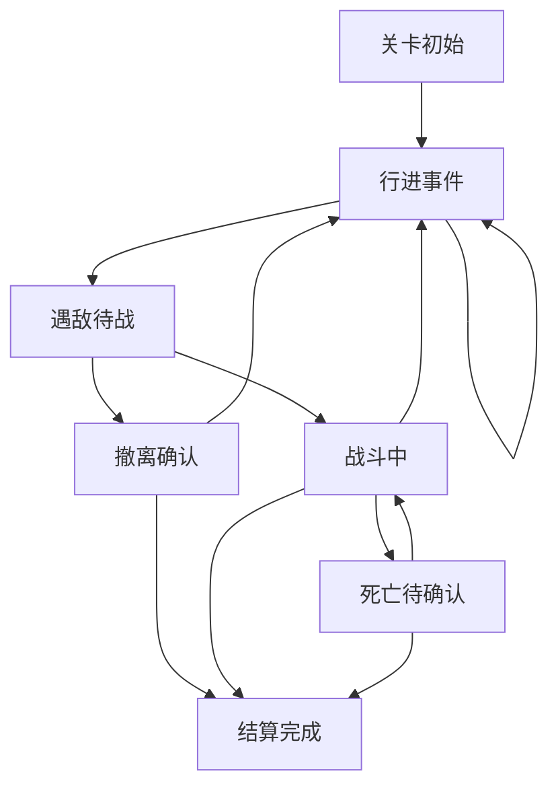

# 探索与战斗实现级方案

版本：v0.1.0  
日期：2026-03-19  
最近更新：2026-03-19 11:25:00  
文档状态：实现级交互方案  
适用对象：产品、程序、测试、运行态验收

## 1. 文档目的

本文档只定义当前版本的：

- 探索页
- 遇敌待战
- 即时战斗
- 撤离
- 死亡
- 结算
- 储物袋页
- 怪物详情弹框

实现目标是让其他线程在不猜测产品意图的前提下，直接完成当前版本的探索与战斗主链。

## 2. 设计结论

当前版本探索与战斗采用：

- `单屏三段式结构`

即探索页始终保持：

1. 顶部信息区
2. 中部舞台区
3. 底部操作区

不同状态只允许在这三个区域中做显隐切换，不允许重新拼页面结构。

## 3. 页面职责定义

### 3.1 探索页唯一职责

- 承接当前关卡行进过程
- 展示遇敌、待战、战斗、死亡、结算前状态
- 承接进入储物袋和怪物详情

### 3.2 探索页禁止承担

- 战前神通长期管理
- 关卡选择
- 大段剧情叙事
- 永久纳戒库存浏览

### 3.3 储物袋页唯一职责

- 展示本次历练中的临时物资与战利品
- 允许使用回灵丹与传送符

### 3.4 怪物详情弹框唯一职责

- 展示当前敌人的必要战斗信息
- 帮助玩家判断是否开战或撤离

## 4. 探索状态机

### 4.1 状态列表

探索页固定只有以下 6 个状态：

1. `关卡初始`
2. `行进事件`
3. `遇敌待战`
4. `战斗中`
5. `死亡待确认`
6. `结算完成`

### 4.2 状态转换图

### 4.3 状态定义

#### 4.3.1 关卡初始

触发条件：
- 玩家从历练页进入副本

页面目标：
- 告诉玩家当前进入了哪一关
- 给出首次推进入口

#### 4.3.2 行进事件

触发条件：
- 玩家点击 `探索`
- 或自动推进触发一层推进

页面目标：
- 呈现短时提示文本
- 或呈现非战斗事件
- 决定下一步是继续行进还是进入遇敌

#### 4.3.3 遇敌待战

触发条件：
- 当前层命中敌人

页面目标：
- 告诉玩家“敌人是谁”
- 让玩家在开战前做一次最小决策：
  - 直接战斗
  - 撤离
  - 进储物袋补给
  - 查看怪物详情

#### 4.3.4 战斗中

触发条件：
- 玩家点击 `战斗`

页面目标：
- 只呈现战斗过程
- 不再掺杂探索按钮与多余入口

#### 4.3.5 死亡待确认

触发条件：
- 我方气血归零

页面目标：
- 给玩家最后一次决策：
  - 广告复活
  - 认命离开
  - 打开储物袋确认当前物资

#### 4.3.6 结算完成

触发条件：
- 通关
- 成功撤离
- 死亡后选择认命离开

页面目标：
- 告诉玩家这次历练最终保住了什么、失去了什么
- 给出明确返回路径

## 5. 三段式布局规范

### 5.1 顶部信息区

始终固定在顶部，不滚动。

必须承载：
- 关卡名
- 当前层数
- 遇敌态及战斗态下的敌人名称
- 遇敌态及战斗态下的敌方血条

禁止承载：
- 大段说明文
- 按钮群
- 储物袋内容

### 5.2 中部舞台区

始终固定在中部，不滚动。

只允许承载：
- 短时提示文本
- 事件文本
- 敌方视觉主体
- 战斗舞台表现

禁止承载：
- 底部按钮
- 长列表
- 永久库存

### 5.3 底部操作区

始终固定在底部，不滚动。

必须承载：
- 我方血条
- 当前状态对应的底部按钮
- 战斗中的 1 行 3 列神通格

禁止承载：
- 长日志
- 展开式储物袋详情
- 多层说明文本

## 6. 各状态显隐规则

### 6.1 关卡初始

顶部显示：
- 关卡名
- 层数：`0 / 总层数`

中部显示：
- 进入关卡的短时提示

底部显示：
- 我方血条
- `自动推进`
- `探索`
- `储物袋`

底部隐藏：
- 敌方血条
- 神通 CD 条
- 战斗按钮
- 撤离按钮

### 6.2 行进事件

顶部显示：
- 关卡名
- 当前层数

中部显示：
- 短时提示文本
- 或事件文本

底部显示：
- 我方血条
- `自动推进`
- `探索`
- `储物袋`

底部隐藏：
- 敌人信息
- 神通 CD 条
- 战斗按钮

### 6.3 遇敌待战

顶部显示：
- 关卡名
- 当前层数
- 敌人名称
- 敌方血条

中部显示：
- 战斗舞台
- 敌方视觉主体

底部显示：
- 我方血条
- `撤离`
- `战斗`
- `储物袋`
- 1 行 3 列神通格（仅显示名称）

底部隐藏：
- `自动推进`
- `探索`
- CD 动画条

### 6.4 战斗中

顶部显示：
- 关卡名
- 当前层数
- 敌人名称
- 敌方血条

中部显示：
- 战斗舞台
- 敌方视觉主体

底部显示：
- 我方血条
- 1 行 3 列神通格
- 神通 CD 条

底部隐藏：
- `撤离`
- `战斗`
- `储物袋`
- `自动推进`
- `探索`

### 6.5 死亡待确认

顶部显示：
- 关卡名
- 当前层数

中部显示：
- 失败提示文本

底部显示：
- `广告复活`
- `认命离开`
- `储物袋`

底部隐藏：
- 战斗按钮
- 撤离按钮
- 探索按钮
- 自动推进按钮
- 神通 CD 条

### 6.6 结算完成

顶部显示：
- 本次历练结果标题

中部显示：
- 结算摘要

底部显示：
- `返回历练`

## 7. 顶部敌方信息规范

### 7.1 显示时机

只有以下状态允许显示敌方血条：
- `遇敌待战`
- `战斗中`

未遇敌时禁止显示敌方区。

### 7.2 显示内容

只显示：
- 敌人名称
- 当前气血数字
- 敌方血条

禁止显示：
- 气息
- 额外属性列表
- 查看提示文案

### 7.3 点击规则

点击敌方血条区域：
- 打开怪物详情弹框

禁止：
- 点击敌方名称直接开弹框
- 出现“点击上方血条查看详情”提示文案

## 8. 我方信息规范

### 8.1 显示内容

当前版本我方外显信息只保留：
- 当前气血条
- 气血数字

### 8.2 显示方式

- 气血数字显示在血条内部
- 我方与敌方血条样式必须统一
- 数字必须居中

### 8.3 禁止显示

- 煞气
- 攻击
- 防御
- 神识
- 属性加成说明

## 9. 神通格与 CD 显示规范

### 9.1 神通格结构

固定：
- 1 行 3 列

每格在不同状态下的显示规则：

1. 遇敌待战
- 只显示神通名称

2. 战斗中
- 显示神通名称
- 显示 CD 条

### 9.2 CD 条规则

- 未进入战斗前不显示动态 CD 条
- 未发生技能释放前，不允许出现空 CD 区
- CD 条必须平滑变化，不允许跳帧式大幅突变

### 9.3 点击规则

点击神通格：
- 不触发释放
- 仅打开神通详情或说明

当前版本神通释放规则：
- 全部自动按装配顺序与 CD 结算

## 10. 战斗反馈规范

### 10.1 当前版本允许的反馈

只允许以下反馈对玩家可见：
- 敌方血条变化
- 我方血条变化
- 血条数字变化
- 神通 CD 条变化
- 怪物详情弹框

### 10.2 当前版本禁止的反馈

禁止：
- 战斗日志列表
- 大段攻击文字流
- 漂浮长句旁白
- 多余说明弹框

### 10.3 反馈顺序

每次伤害结算应按以下顺序表现：

1. 更新受击方血条数值
2. 播放受击血条抖动
3. 播放血条拖尾
4. 同步更新神通 CD 条

### 10.4 战斗结束后的处理

战斗结束后：
- 立即隐藏 CD 动态区
- 保留敌方信息直到进入下一状态
- 不显示“战斗胜利日志”

## 11. 怪物详情弹框规范

### 11.1 打开方式

仅允许通过点击敌方血条打开。

### 11.2 弹框内容

只允许显示：
- 敌人名称
- 当前气血
- 技能列表

每个技能条目显示：
- 技能名称
- 伤害
- CD
- 特殊效果（仅当为回复气血时显示）

### 11.3 禁止显示

禁止：
- 气息文案
- 攻击/防御/神识等外显属性
- 旧倍率描述
- 旧碎片、旧境界加成说明

## 12. 储物袋页规范

### 12.1 打开方式

从探索页点击 `储物袋` 进入独立页面。

### 12.2 页面结构

固定结构：

1. 顶部返回区
- 左上返回箭头
- 返回探索页

2. 标题区
- 标题：`储物袋`

3. 内容区
- 分为两个分区：
  - `随身物资`
  - `本次战利品`

### 12.3 随身物资

只允许包含：
- 回灵丹
- 传送符

0 数量条目不显示。

### 12.4 本次战利品

只允许包含：
- 本次历练灵石
- 本次历练材料
- 当前关卡掉落物

### 12.5 使用规则

1. 点击回灵丹
- 立即回血
- 数量减少

2. 点击传送符
- 立即进入成功撤离结算

### 12.6 禁止事项

禁止：
- 储物袋页展示永久纳戒全部库存
- 探索页底部直接展开储物袋内容
- 将战利品直接提前写入纳戒

## 13. 撤离与死亡规范

### 13.1 撤离按钮触发

仅在 `遇敌待战` 状态显示 `撤离`。

点击撤离后进入：
- `撤离确认`

### 13.2 撤离确认规则

#### 有传送符

提示：
- 使用传送符可带走当前战利品撤离

按钮：
- `确认撤离`
- `返回`

#### 无传送符

提示：
- 撤离将失去本次战利品

按钮：
- `放弃战利品撤离`
- `广告撤离`
- `返回`

### 13.3 死亡规则

气血归零后：
- 进入 `死亡待确认`

允许：
- 广告复活
- 认命离开
- 打开储物袋确认当前物资

### 13.4 认命离开结果

- 本次战利品清空
- 永久纳戒不增加新战利品
- 已获得经验不回退
- 角色气血回满

## 14. 结算规范

### 14.1 成功撤离或通关

必须发生：
- `runBag` 战利品写入 `inventory`
- 储物袋页面清空
- 返回历练页

### 14.2 死亡离开

必须发生：
- `runBag` 战利品清空
- 永久 `inventory` 不新增
- 返回历练页或人物页

### 14.3 经验规则

当前版本经验规则：
- 经验在敌人死亡时即时获得
- 不在撤离或结算时补发
- 撤离与死亡都不回退已获得经验

## 15. 运行态硬门禁

### 15.1 微信开发者工具硬门禁

所有涉及探索与战斗交互的改动，必须到微信开发者工具验证以下 8 条：

1. 未遇敌时不显示敌方信息
2. 遇敌时顶部敌方血条不与关卡标题重叠
3. 战斗中不再显示撤离 / 战斗 / 储物袋按钮
4. 未发生技能释放前不出现空 CD 区
5. 战斗中只保留我方血条与 1 行 3 列神通格
6. 储物袋是独立页，不在探索页底部展开
7. 死亡离开后战利品不写回纳戒
8. 成功撤离后战利品写回纳戒

### 15.2 Smoke Case

#### Case A：未遇敌常态

步骤：
1. 进入探索页
2. 不推进

通过标准：
- 只看到我方血条与 `自动推进 / 探索 / 储物袋`
- 看不到敌方区

#### Case B：遇敌待战

步骤：
1. 推进直到遇敌

通过标准：
- 顶部出现敌人名称与血条
- 底部出现 `撤离 / 战斗 / 储物袋`
- 神通格只显示名称

#### Case C：战斗中

步骤：
1. 遇敌后点击 `战斗`

通过标准：
- `撤离 / 战斗 / 储物袋` 全部隐藏
- 神通格开始显示 CD 条
- 无战斗日志刷屏

#### Case D：储物袋使用传送符

步骤：
1. 遇敌待战或行进中打开储物袋
2. 点击传送符

通过标准：
- 直接进入成功撤离结算
- 当前战利品写回纳戒

#### Case E：死亡离开

步骤：
1. 战斗失败
2. 点击 `认命离开`

通过标准：
- 当前战利品丢失
- 已获得经验保留

## 16. 明确不做

当前版本不做：
- 探索页战斗日志
- 探索页大段战斗文本
- 探索页内展开式储物袋
- 旧煞气
- 旧属性外显
- 旧群体神通特殊 UI

## 17. 下个文档建议

本方案之后，最应该补的是：

1. `敌人与关卡脚本真源接入规范`
2. `人物页与洞府中枢实现级方案`
