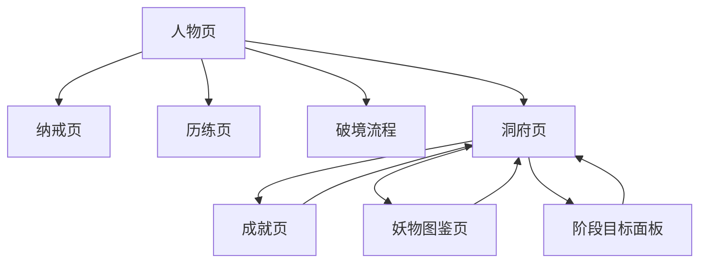

# 人物页与洞府中枢实现级方案

版本：v0.1.0  
日期：2026-03-19  
最近更新：2026-03-19 11:55:00  
文档状态：实现级交互方案  
适用对象：产品、程序、测试、运行态验收

## 1. 文档目的

本文档只定义当前版本的：

- 人物页
- 洞府页
- 纳戒页入口关系
- 破境入口关系
- 阶段目标面板
- 与成就 / 图鉴 / 历练的行动引导关系

目标不是“信息展示页”，而是把玩家从人物与洞府两页中**明确推回主线推进**。

关联实现规范：
- [轻肉鸽交互与页面总方案.md](/Users/cuihua/Documents/git/minigame-1/product/实现规范/轻肉鸽交互与页面总方案.md)
- [轻肉鸽战斗边界状态机与写回规则.md](/Users/cuihua/Documents/git/minigame-1/product/实现规范/轻肉鸽战斗边界状态机与写回规则.md)
- [轻肉鸽真源桥接与中间主表规范.md](/Users/cuihua/Documents/git/minigame-1/product/实现规范/轻肉鸽真源桥接与中间主表规范.md)

## 2. 设计结论

当前版本人物与洞府采用：

- `人物页 = 当前成长状态页`
- `洞府页 = 次级功能中枢页`

也就是说：

1. 人物页负责回答：
- 我现在是谁
- 我当前修为到哪了
- 我能不能破境
- 我现在下一步该干嘛

2. 洞府页负责回答：
- 除了继续历练，我还能在哪看长期目标
- 我的成就进度、图鉴进度、阶段目标到哪了

## 3. 页面关系总览

## 4. 人物页实现规范

### 4.1 页面唯一职责

人物页只负责：

1. 展示当前角色成长状态
2. 提供纳戒入口
3. 提供破境入口
4. 给出当前版本最明确的下一步行动引导

### 4.2 页面禁止承担

禁止：
- 成就入口
- 图鉴入口
- 洞府入口之外的复杂功能集成
- 大段玩法说明

### 4.3 页面结构

从上到下固定为：

1. 角色标题区
- 角色名
- 境界名
- 修为百分比或经验值

2. 核心状态区
- 当前气血
- 当前装备摘要

3. 当前行动引导区
- 当前主推关卡
- 距离下一小境界或突破还差多少
- 当前阻塞条件

4. 功能按钮区
- `纳戒`
- `破境`
- `洞府`

### 4.4 角色标题区

必须显示：
- 角色名
- 当前大境界 + 小境界
- 当前修为经验：`当前值 / 当前阶段所需值`

禁止显示：
- 旧十重
- 煞气
- 攻击 / 防御 / 神识等旧外显属性

### 4.5 核心状态区

只允许显示：
- 当前气血条
- 气血数字
- 装备摘要

装备摘要当前版本只需显示：
- 武器
- 法衣
- 灵饰

若为空：
- 显示 `无`

### 4.6 当前行动引导区

该区域是人物页当前版本最重要的新增核心。

必须固定显示 3 行：

1. `当前主推`
- 如：`当前主推：筑基·青云剑墟`

2. `当前目标`
- 若未满经验：`目标：继续击败敌人积累修为`
- 若后期满经验且无突破丹：`目标：获取突破丹后破境`
- 若后期满经验且有突破丹：`目标：可立即破境`

3. `当前阻塞`
- 如：
  - `还差 359 修为经验`
  - `缺少突破丹`
  - `建议先完成当前主推副本`

### 4.7 功能按钮区

当前版本只保留 3 个入口：

1. `纳戒`
2. `破境`
3. `洞府`

禁止继续把：
- 成就
- 图鉴
- 其他收藏入口  
放回人物页

### 4.8 纳戒按钮规则

点击 `纳戒`：
- 进入纳戒页

按钮常驻显示，不做禁用。

### 4.9 破境按钮规则

破境按钮有 3 种状态：

1. `不可突破`
- 文案：`未满足`
- 点击后只提示缺失条件

2. `可突破`
- 文案：`破境`
- 高亮显示

3. `突破冷却`
- 文案：`冷却中`
- 点击后提示剩余冷却

### 4.10 洞府按钮规则

点击 `洞府`：
- 进入洞府页

按钮常驻显示，不做禁用。

## 5. 人物页行动引导规则

### 5.1 主推关卡判定

人物页主推关卡与历练页主推关卡必须一致。

优先级：

1. 当前小境界对应关卡
2. 若该关已完成且经验已满，则主推下一小境界关卡
3. 若满足突破条件，则主推改为 `立即破境`

### 5.2 当前目标判定

#### 未满经验

显示：
- `继续击败敌人积累修为`

#### 后期满经验但无突破丹

显示：
- `获取突破丹后破境`

#### 后期满经验且有突破丹

显示：
- `可立即破境`

### 5.3 当前阻塞判定

当前阻塞只允许来自以下 3 类：

1. 经验不足
2. 缺少突破丹
3. 当前主推副本未完成

禁止显示模糊文案：
- `继续努力`
- `尚未准备好`
- `请稍后`

## 6. 破境交互规范

### 6.1 进入条件

必须同时满足：
- 当前大境界处于后期
- 修为经验达到 100%
- 拥有对应突破丹

### 6.2 触发流程

点击 `破境` 后：

1. 条件不满足
- 只提示缺失条件

2. 条件满足
- 进入突破确认

### 6.3 确认弹层

必须显示：
- 当前境界
- 目标境界
- 突破丹消耗
- 当前成功率

按钮：
- `确认破境`
- `返回`

### 6.4 突破结果反馈

成功时：
- 境界更新
- 经验清零
- 血量刷新
- 弹出成功反馈

失败时：
- 显示失败反馈
- 明确剩余冷却

### 6.5 禁止事项

禁止：
- 点击破境后直接黑箱执行
- 不告知消耗与成功率
- 失败后只给抽象文案，不告知冷却状态

## 7. 洞府页实现规范

### 7.1 页面唯一职责

洞府页是：
- 次级功能中枢页

只负责承接：
- 成就
- 妖物图鉴
- 阶段目标

### 7.2 页面禁止承担

禁止：
- 挂机收益
- 灵矿 / 灵仆 / 药园 / 丹房
- 洞府升级
- 产能概览
- 领取产出

### 7.3 页面结构

从上到下固定为：

1. 标题区
- 标题：`洞府`

2. 当前状态摘要区
- 当前境界
- 当前主推副本
- 当前阶段阻塞

3. 功能入口区
- `成就`
- `妖物图鉴`
- `阶段目标`

4. 底部主导航区

### 7.4 当前状态摘要区

必须显示：

1. 当前境界
- 如：`当前境界：结丹中期`

2. 当前主推
- 如：`主推副本：熔火回廊`

3. 当前阻塞
- 如：
  - `还差 2875 修为经验`
  - `缺少突破丹`
  - `建议先完成当前主推副本`

洞府摘要必须与人物页行动引导保持一致，不允许两个页面给出不同建议。

### 7.5 功能入口卡规范

每张入口卡都必须包含：
- 标题
- 一行摘要
- 可点击热区

#### 成就卡

标题：
- `成就`

摘要：
- 当前可领取奖励数
- 当前完成度摘要

#### 妖物图鉴卡

标题：
- `妖物图鉴`

摘要：
- 已解锁数 / 总数

#### 阶段目标卡

标题：
- `阶段目标`

摘要：
- 当前境界目标
- 当前主推副本
- 当前突破条件

### 7.6 禁止事项

禁止：
- 洞府首页只有三个空按钮没有状态摘要
- 用大段说明文替代行动信息
- 把旧生产链说明残留在洞府页

## 8. 阶段目标面板规范

### 8.1 面板目标

阶段目标面板是洞府页内最强的“下一步提示器”。

### 8.2 必须显示的 4 项

1. 当前境界
2. 当前主推副本
3. 下一成长目标
4. 当前突破条件

### 8.3 目标生成规则

#### 未满经验

下一成长目标：
- `继续推进 {主推副本}`

#### 后期满经验但无突破丹

下一成长目标：
- `获取突破丹后破境`

#### 后期满经验且有突破丹

下一成长目标：
- `立即回人物页破境`

### 8.4 当前突破条件显示

只允许显示：
- 是否后期
- 是否满经验
- 是否拥有突破丹

格式必须清楚区分“已满足 / 未满足”。

## 9. 纳戒页与人物页的关系

### 9.1 纳戒页角色

纳戒页是永久库存页。

### 9.2 从人物页进入的要求

人物页点击 `纳戒` 后：
- 进入纳戒页
- 纳戒页左上返回
- 返回人物页

### 9.3 当前纳戒页必须服务的行为

- 查看当前永久库存
- 确认是否拥有突破丹
- 确认战利品是否已写入

所以人物页行动引导中若当前阻塞是“缺少突破丹”，玩家必须能通过纳戒页快速验证。

## 10. 成就页与图鉴页的入口要求

### 10.1 入口归属

当前正式规则：
- 成就从洞府进入
- 图鉴从洞府进入

### 10.2 当前体验问题处理原则

成就页与图鉴页目前虽然能打开，但不允许继续沿用伪滚动交互扩散到其他页面。

因此：
- 人物页和洞府页只负责正确引导进入
- 交互修复另行在独立方案中收口

## 11. 页面间行动闭环

当前推荐闭环固定为：

1. 人物页看当前成长状态
2. 若要继续推进，进入历练
3. 若需要看长期目标，进入洞府
4. 若需要验证永久库存，进入纳戒
5. 若满足破境条件，回人物页执行破境

这条闭环必须让玩家在任一时刻都知道：
- 现在能不能打
- 现在能不能破
- 现在缺什么

## 12. 运行态硬门禁

涉及人物页与洞府交互的改动，必须在微信开发者工具验证以下 7 条：

1. 人物页能一眼看到当前境界、当前经验、当前主推
2. 人物页点击 `纳戒` 能正常进入并返回
3. 人物页点击 `破境` 在条件不足时能明确提示缺失项
4. 人物页点击 `破境` 在条件满足时能进入确认流程
5. 洞府页能看到当前状态摘要，不是只有空入口
6. 洞府页 3 个入口卡都能进入正确页面或面板
7. 人物页和洞府页给出的“当前主推 / 当前阻塞”信息一致

## 13. Smoke Case

### 13.1 Case A：人物页行动引导

步骤：
1. 打开人物页

通过标准：
- 能看到：
  - 当前境界
  - 当前经验
  - 当前主推
  - 当前目标
  - 当前阻塞

### 13.2 Case B：洞府状态摘要

步骤：
1. 从人物页进入洞府

通过标准：
- 能看到：
  - 当前境界
  - 主推副本
  - 当前阻塞
- 不再看到旧挂机产出与生产链内容

### 13.3 Case C：破境缺失条件提示

步骤：
1. 条件不满足时点击 `破境`

通过标准：
- 清楚提示缺的是：
  - 经验
  - 后期阶段
  - 突破丹

### 13.4 Case D：破境确认

步骤：
1. 条件满足时点击 `破境`

通过标准：
- 出现确认层
- 能看到消耗、成功率、目标境界

## 14. 当前版本明确不做

当前版本不做：
- 洞府升级
- 洞府产出
- 洞府生产链
- 人物页成就入口回流
- 人物页图鉴入口回流

## 15. 与其他方案的关系

本文件与以下文档一起构成当前主线体验真源：

1. [当前产品需求.md](/Users/cuihua/Documents/git/minigame-1/product/prd_doc/current_prd.md)
2. [轻肉鸽交互与页面总方案.md](/Users/cuihua/Documents/git/minigame-1/product/实现规范/轻肉鸽交互与页面总方案.md)
3. [轻肉鸽战斗边界状态机与写回规则.md](/Users/cuihua/Documents/git/minigame-1/product/实现规范/轻肉鸽战斗边界状态机与写回规则.md)
4. [轻肉鸽真源桥接与中间主表规范.md](/Users/cuihua/Documents/git/minigame-1/product/实现规范/轻肉鸽真源桥接与中间主表规范.md)

## 16. 下个文档建议

本方案之后，最应该补的是：

1. `成就与妖物图鉴实现级方案`
2. `破境与渡劫反馈实现级方案`
