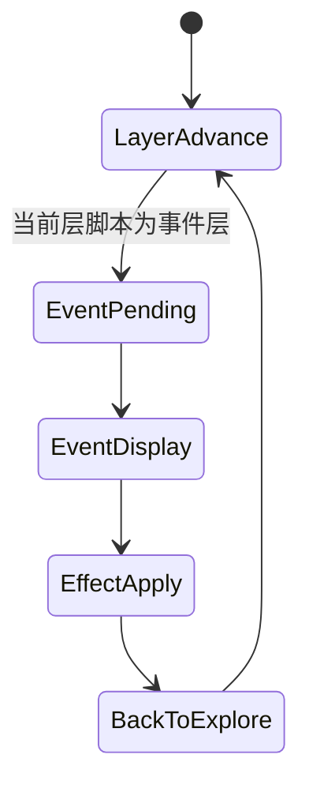

# 历练事件实现级方案

## 1. 文档定位
本文档用于定义探索流程中的“非战斗事件”如何正式接入与呈现，避免事件系统继续停留在随机文案占位层。

当前版本定位：
- 历练事件：正式实现
- 文本文风：基础模板版，可后续润色

本文档约束：
- 若与总 PRD 冲突，以 [当前产品需求.md](/Users/cuihua/Documents/git/minigame-1/product/产品需求/当前产品需求.md) 为准。
- 若与运行时代码冲突，以本文档作为后续实现目标。

## 2. 功能目标
历练事件的职责只有三个：
1. 打断纯战斗节奏
2. 提供轻量收益或轻量损耗
3. 增强关卡推进中的氛围感

历练事件当前不承担：
- 复杂分支剧情
- 多选项树状决策
- 隐藏剧情线
- 长剧情弹层

## 3. 数据真源
### 3.1 正式真源
- [历练事件配置总表.csv](/Users/cuihua/Documents/git/minigame-1/product/数值策划/历练事件配置总表.csv)
- [关卡楼层脚本总表.csv](/Users/cuihua/Documents/git/minigame-1/product/数值策划/关卡楼层脚本总表.csv)
- [道具配置总表.csv](/Users/cuihua/Documents/git/minigame-1/product/数值策划/道具配置总表.csv)

### 3.2 真源职责划分
- `历练事件配置总表.csv`
  - 定义事件类型、标题、文案、效果与适用范围
- `关卡楼层脚本总表.csv`
  - 定义每层是否进入事件层
- `道具配置总表.csv`
  - 当事件奖励道具时，定义具体道具含义

### 3.3 禁止事项
- 不允许在代码中新增未登记于 `历练事件配置总表.csv` 的正式事件。
- 不允许用随机战斗代替正式事件层。
- 不允许在事件页额外发放修为经验。

## 4. 事件类型定义
### 4.1 当前正式事件类型
1. 线索文本
- 仅提供叙事，不改数值

2. 灵石事件
- 直接增加本次历练灵石收益

3. 材料事件
- 增加当前关卡材料或功能道具

4. 陷阱事件
- 直接损失一定比例气血

### 4.2 当前版本不提供
- 事件分支选项
- 同屏多个按钮选择
- 成败判定小游戏
- 可重复刷取的固定彩蛋点

## 5. 探索事件状态机

### 5.1 状态说明
1. `EventPending`
- 已确定当前层不是战斗层，而是事件层
- 读取事件真源并准备展示

2. `EventDisplay`
- 页面中部展示事件标题与事件文案
- 底部仍保留人物气血与可用按钮

3. `EffectApply`
- 根据事件真源执行灵石/材料/道具/气血变化
- 事件文本短暂停留后结束

## 6. 事件页面实现规范
### 6.1 顶部区
必须显示：
- 当前关卡名
- 当前层数

禁止显示：
- 敌方名称
- 战斗中按钮
- 神通 CD 区

### 6.2 中部区
必须显示：
- 事件标题
- 事件文案

显示规则：
- 文案居中
- 事件文案可以多行，但不得超出中部区安全边界
- 文案停留结束后淡出

### 6.3 底部区
必须显示：
- 我方当前气血
- `自动推进`
- `探索`
- `储物袋`

禁止显示：
- 撤离 / 战斗按钮
- 怪物详情入口

## 7. 事件效果规则
### 7.1 线索文本
- 不改变任何数值
- 仅记录 1 次事件发生

### 7.2 灵石事件
- 灵石收益写入当前 `runBag`
- 不直接写入纳戒

### 7.3 材料事件
- 材料或功能道具写入当前 `runBag`
- 道具必须来自 `道具配置总表.csv`

### 7.4 陷阱事件
- 直接按真源参数扣减气血
- 若扣减后气血 <= 0，则进入死亡待确认态

### 7.5 冲突约束
- 事件层不得同时触发战斗层
- 事件不得直接授予修为经验
- 事件奖励的道具不得绕过储物袋直接进纳戒

## 8. 标题与文案规范
### 8.1 标题规范
标题必须短且可一眼读懂事件性质，例如：
- `前路微光`
- `碎石藏辉`
- `灵压逆冲`

### 8.2 文案规范
要求：
- 单段简洁
- 不使用长篇旁白
- 不写需要玩家做选择却无法选择的句子

禁止：
- “你可以选择……”这类假选择文案
- 数值效果与文案表达冲突

## 9. 写回规则
1. 事件奖励灵石 / 材料 / 道具
- 写入 `runBag`

2. 成功撤离或通关
- `runBag` 内事件收益写入 `inventory`

3. 失败或认命离开
- 当前事件收益与其他本次战利品一起丢失

## 10. 依赖关系
1. 依赖 [探索与战斗实现级方案.md](/Users/cuihua/Documents/git/minigame-1/product/实现规范/探索与战斗实现级方案.md)
- 决定事件态在探索主链中的位置

2. 依赖 [敌人与关卡脚本真源接入规范.md](/Users/cuihua/Documents/git/minigame-1/product/实现规范/敌人与关卡脚本真源接入规范.md)
- 决定楼层脚本如何指定事件层

3. 依赖 [道具与装备轻实现级方案.md](/Users/cuihua/Documents/git/minigame-1/product/实现规范/道具与装备轻实现级方案.md)
- 决定事件奖励道具写入与后续使用边界

## 11. 微信开发者工具验收
### 11.1 必测项
- 事件层出现时不显示敌方信息
- 事件层出现时不显示战斗按钮
- 线索文本不改变数值
- 灵石事件收益进入储物袋
- 材料事件收益进入储物袋
- 陷阱事件会正确扣血
- 陷阱事件扣死后进入死亡待确认
- 事件结束后能继续推进下一层

### 11.2 Smoke Case
- `WT-26`：线索文本事件正常展示并结束
- `WT-27`：灵石事件增加本次历练灵石
- `WT-28`：材料事件掉落道具进入储物袋
- `WT-29`：陷阱事件扣血但未死亡，可继续探索
- `WT-30`：陷阱事件扣血致死，进入死亡待确认态

## 12. 结论
当前版本的历练事件系统必须保持“轻量、明确、可回写”。

重点不是把事件做成剧情游戏，而是：
- 让探索节奏不只剩战斗
- 让收益和损耗都可被玩家快速理解
- 让事件收益与储物袋 / 纳戒结算逻辑完全一致
