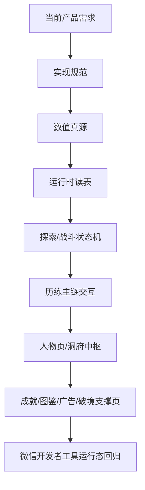

# 实现优先级与重构顺序

## 1. 文档定位
本文档用于约束后续实现线程的修改顺序，避免在当前项目仍存在真源未接入、页面职责混乱、运行态未闭环的情况下并行乱改，造成返工。

## 2. 当前总原则
实现顺序必须遵守：
1. 先接真源
2. 再拆状态机
3. 再改主交互
4. 再补支撑页
5. 最后做微信运行态回归

禁止顺序：
- 先改页面观感，再补真源
- 先修局部交互，再继续沿用旧公式造怪
- 先铺支撑页，再让主链继续断着

## 3. 当前最关键的依赖关系

## 4. 正式实现顺序
### 4.1 第一阶段：真源接入
目标：让代码真正消费正式真源，而不是继续靠临时公式和硬编码撑运行时。

必须优先接入：
1. [敌人配置总表.csv](/Users/cuihua/Documents/git/minigame-1/product/数值策划/敌人配置总表.csv)
2. [关卡修为经验与境界升级表.csv](/Users/cuihua/Documents/git/minigame-1/product/数值策划/关卡修为经验与境界升级表.csv)
3. [关卡楼层脚本总表.csv](/Users/cuihua/Documents/git/minigame-1/product/数值策划/关卡楼层脚本总表.csv)
4. [神通配置总表.csv](/Users/cuihua/Documents/git/minigame-1/product/数值策划/神通配置总表.csv)
5. [道具配置总表.csv](/Users/cuihua/Documents/git/minigame-1/product/数值策划/道具配置总表.csv)

原因：
- 不先接真源，后续交互和状态机越改越偏。
- 真源不接入，微信运行态只能验证“假逻辑”。

### 4.2 第二阶段：探索状态机与运行时拆解
目标：先解除 `ExplorePanel` 上帝类风险。

必须先拆：
- 选关态
- 探索态
- 遇敌待战态
- 战斗态
- 储物袋态
- 复活确认 / 失败结算态
- 结算态

原因：
- 若不先拆状态机，后面任何历练体验改动都会继续互相污染。

### 4.3 第三阶段：历练主链重构
目标：把历练改成正式的“选关直进战场 + 独立技能页”结构。

顺序：
1. 历练选关页
2. 技能页
3. 从历练页直接进入战场页

原因：
- 这是当前玩家体验最差的部分
- 但必须建立在真源接入和探索状态机拆解之后

### 4.4 第四阶段：人物页与洞府中枢收口
目标：让玩家知道下一步做什么。

顺序：
1. 人物页行动引导
2. 洞府中枢摘要
3. 破境入口联动
4. 成就 / 图鉴摘要

### 4.5 第五阶段：支撑页与轻实现补齐
包括：
- 成就页
- 妖物图鉴页
- 广告系统
- 道具 / 装备轻实现
- 历练事件

这些必须建立在主链稳定后再补，不得反客为主。

### 4.6 第六阶段：微信运行态验收闭环
目标：所有交互改动必须过微信开发者工具 smoke case。

要求：
- 每完成一个阶段，至少跑一轮对应 WT 用例
- 不允许只靠 `tsc` 或 preview 成功就判定“已完成”

## 5. 模块依赖矩阵
| 模块 | 依赖前置 | 不能先于 | 说明 |
| --- | --- | --- | --- |
| 敌人运行时读表 | 数值真源 | 历练交互重构 | 不然交互基于假敌人 |
| 关卡楼层脚本接入 | 数值真源 | 探索状态机细化 | 不然事件层与战斗层都可能错 |
| 神通运行时读表 | 数值真源 | 技能页与三选一卡池微调 | 不然手感建立在假 CD/伤害上 |
| ExplorePanel 状态机拆解 | 真源接入 | 历练双页结构全面落地 | 不然继续混屏反噬 |
| 历练双页结构 | Explore 状态拆解 | 支撑页继续优化 | 主链先纯化 |
| 人物页行动引导 | 历练主链明确 | 洞府摘要精修 | 不然不知道主推副本 |
| 成就/图鉴 | 洞府中枢 | 不依赖先做 | 支撑页不能先于主链 |
| 广告系统 | 破境/探索状态机 | 不能单独先做 | 广告必须挂在正式状态上 |

## 6. 当前禁止并行的改法
### 6.1 禁止项
1. 在未接入敌人真源前，继续调 Boss 数值体验
2. 在未拆探索状态机前，继续堆探索页显隐分支
3. 在历练主链未拆双页前，继续微调“混屏整备交互”
4. 在人物页和洞府目标摘要未明确前，继续加更多支撑页入口
5. 在未形成微信运行态闭环前，把交互改动判定为完成

### 6.2 原因
这些改法共同的问题是：
- 表面上在修体验
- 实际上会继续加深架构债务

## 7. 与其他规范的依赖关系
1. [修仙轻肉鸽自动施法战斗总方案.md](/Users/cuihua/Documents/git/minigame-1/product/实现规范/修仙轻肉鸽自动施法战斗总方案.md)
2. [轻肉鸽交互与页面总方案.md](/Users/cuihua/Documents/git/minigame-1/product/实现规范/轻肉鸽交互与页面总方案.md)
3. [轻肉鸽战斗边界状态机与写回规则.md](/Users/cuihua/Documents/git/minigame-1/product/实现规范/轻肉鸽战斗边界状态机与写回规则.md)
4. [轻肉鸽真源桥接与中间主表规范.md](/Users/cuihua/Documents/git/minigame-1/product/实现规范/轻肉鸽真源桥接与中间主表规范.md)
5. [人物页与洞府中枢实现级方案.md](/Users/cuihua/Documents/git/minigame-1/product/实现规范/人物页与洞府中枢实现级方案.md)
6. [成就与妖物图鉴实现级方案.md](/Users/cuihua/Documents/git/minigame-1/product/实现规范/成就与妖物图鉴实现级方案.md)
7. [广告系统实现级方案.md](/Users/cuihua/Documents/git/minigame-1/product/实现规范/广告系统实现级方案.md)
8. [破境与渡劫实现级方案.md](/Users/cuihua/Documents/git/minigame-1/product/实现规范/破境与渡劫实现级方案.md)
9. [道具与装备轻实现级方案.md](/Users/cuihua/Documents/git/minigame-1/product/实现规范/道具与装备轻实现级方案.md)
10. [历练事件实现级方案.md](/Users/cuihua/Documents/git/minigame-1/product/实现规范/历练事件实现级方案.md)
11. [微信开发者工具运行态验收总表.md](/Users/cuihua/Documents/git/minigame-1/product/实现规范/微信开发者工具运行态验收总表.md)

## 8. 交给实现线程的结论
实现线程现在最容易犯的错误，不是写错一段代码，而是：
- 顺序错了
- 把轻实现当主线改了
- 在假真源上做体验优化

因此当前最优路径只有一条：
**先接真源，再拆状态，再重构主链，最后做运行态回归。**
