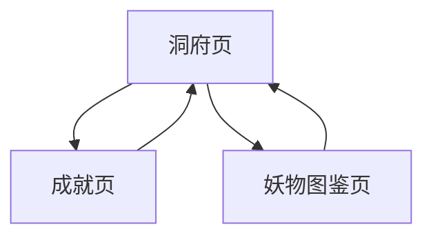

# 成就与妖物图鉴实现级方案

版本：v0.1.0  
日期：2026-03-19  
最近更新：2026-03-19 15:45:00  
文档状态：实现级交互方案  
适用对象：产品、程序、测试、运行态验收

## 1. 文档目的

本文档只定义当前版本的：

- 成就页
- 妖物图鉴页
- 洞府到成就 / 图鉴的入口关系
- 成就奖励查看与领取
- 妖物图鉴解锁与详情查看

目标不是“补两个收藏页”，而是让：
- 成就页承担长期目标反馈
- 妖物图鉴页承担收集反馈与敌人认知补充

并且明确禁止继续使用当前那种伪滚动交互。

## 2. 设计结论

当前版本采用：

- `成就页 = 长期目标反馈页`
- `妖物图鉴页 = 敌人档案与收集反馈页`

这两页都属于：
- `洞府页` 的次级功能页

它们的职责都是：
- 增强长期推进感
- 补充中长期反馈

它们都不应该承担：
- 主线推进决策
- 战前配置
- 临时战斗操作

## 3. 页面关系总览

## 4. 成就页实现规范

### 4.1 页面唯一职责

成就页只负责：

1. 展示长期目标分类
2. 展示当前成就进度
3. 提供奖励查看与领取

### 4.2 页面禁止承担

禁止：
- 翻页式老列表
- 伪滚动
- 奖励直接常驻大面积展开
- 作为人物页的平替入口

### 4.3 页面结构

从上到下固定为：

1. 顶部返回与标题区
2. 成就分类摘要区
3. 成就列表区
4. 奖励详情弹层

### 4.4 顶部返回与标题区

必须显示：
- 左上返回箭头
- 页面标题 `成就`

返回路径固定：
- 返回 `洞府页`

### 4.5 成就分类

当前版本固定分类：
- `历练`
- `境界`
- `收集`

每条成就至少包含：
- `achievementId`
- `category`
- `title`
- `currentProgress`
- `targetProgress`
- `rewardType`
- `rewardValue`
- `claimState`

### 4.6 成就列表项

每个列表项固定展示：
- 标题
- 当前进度 / 目标进度
- 进度条
- 当前状态标签

状态标签只允许：
- `进行中`
- `可领取`
- `已领取`

### 4.7 成就奖励查看

点击成就列表项：
- 打开奖励详情弹层

弹层必须显示：
- 成就名称
- 分类
- 当前进度
- 奖励内容
- 领取按钮（若可领取）

禁止：
- 在列表外层直接长期展开奖励详情

### 4.8 成就领取

当状态为 `可领取` 时：
- 弹层内显示 `领取奖励`

点击后：
- 奖励立即写入纳戒
- 状态切为 `已领取`
- 洞府页成就摘要同步刷新

### 4.9 列表滚动规则

当前版本成就页只允许两种实现：

1. 真正的触摸滚动
2. 分页切换

明确禁止：
- 点击上半 / 下半区域模拟滚动
- 用空白热区伪装滚动行为

当前推荐实现：
- 真滚动优先

## 5. 妖物图鉴页实现规范

### 5.1 页面唯一职责

妖物图鉴页只负责：

1. 展示已解锁妖物档案
2. 补充敌人名称、归属关卡与技能认知
3. 提供收集完成度反馈

### 5.2 页面禁止承担

禁止：
- 成为战斗页的替代信息面板
- 展示复杂数值推导
- 展示旧“气息”、旧攻防神识外显
- 使用伪滚动

### 5.3 页面结构

从上到下固定为：

1. 顶部返回与标题区
2. 图鉴完成度区
3. 妖物列表区
4. 妖物详情弹层

### 5.4 顶部返回与标题区

必须显示：
- 左上返回箭头
- 页面标题 `妖物图鉴`

返回路径固定：
- 返回 `洞府页`

### 5.5 图鉴完成度区

必须显示：
- 当前已解锁数量
- 总数量
- 完成百分比

示例：
- `已解锁 18 / 126`

### 5.6 图鉴列表项

每个妖物列表项固定展示：
- 妖物名称
- 所属境界 / 所属关卡
- 解锁状态

解锁状态只允许：
- `已解锁`
- `未解锁`

未解锁项允许展示：
- 占位名或 `未知妖物`

### 5.7 图鉴解锁规则

当前版本固定规则：
- 首次遭遇妖物时解锁图鉴

不要求：
- 首次击杀才解锁

### 5.8 妖物详情弹层

点击已解锁妖物：
- 打开详情弹层

弹层只允许显示：
- 妖物名称
- 所属境界
- 所属关卡
- 当前气血上限
- 技能名 / 伤害 / CD / 回复效果

禁止显示：
- 气息
- 攻击 / 防御 / 神识 / 速度
- 旧倍率说明

### 5.9 列表滚动规则

妖物图鉴页与成就页一致：
- 允许真滚动
- 允许分页
- 禁止伪滚动

当前推荐实现：
- 真滚动优先

## 6. 洞府入口规则

### 6.1 洞府页必须提供

洞府页必须固定提供：
- `成就`
- `图鉴`

### 6.2 洞府摘要

洞府页外层摘要只需显示：

1. 成就摘要
- 已领取数量 / 可领取数量

2. 图鉴摘要
- 已解锁数量 / 总数量

禁止：
- 在洞府首页直接展开长列表

## 7. 数据与存档规则

### 7.1 成就

成就数据最少包含：
- `achievementProgress`
- `achievementClaimed`

奖励领取后：
- 立即写入纳戒
- 不允许先进入储物袋

### 7.2 图鉴

图鉴数据最少包含：
- `monsterDexUnlocked[]`

遭遇时解锁后：
- 必须立即写入本地存档

## 8. 微信开发者工具验收标准

### 8.1 成就页必须通过

1. 从洞府进入成就页
2. 左上返回能回洞府
3. 列表滚动自然或分页切换正常
4. 可领取成就点击后弹层出现
5. 领取后状态切为 `已领取`
6. 奖励进入纳戒

### 8.2 妖物图鉴页必须通过

1. 从洞府进入图鉴页
2. 左上返回能回洞府
3. 已解锁数量统计正确
4. 遭遇新妖物后图鉴数量增加
5. 点击已解锁妖物可看详情
6. 详情中不出现旧外显属性与旧气息

## 9. 明确禁止事项

1. 禁止继续保留成就页伪滚动
2. 禁止继续保留图鉴页伪滚动
3. 禁止把成就 / 图鉴入口放回人物页
4. 禁止在图鉴详情里恢复旧属性展示
5. 禁止把成就奖励先放入储物袋

## 10. 与其他实现规范的关系

关联文档：
- [历练主链实现级方案.md](/Users/cuihua/Documents/git/minigame-1/product/实现规范/历练主链实现级方案.md)
- [探索与战斗实现级方案.md](/Users/cuihua/Documents/git/minigame-1/product/实现规范/探索与战斗实现级方案.md)
- [敌人与关卡脚本真源接入规范.md](/Users/cuihua/Documents/git/minigame-1/product/实现规范/敌人与关卡脚本真源接入规范.md)
- [人物页与洞府中枢实现级方案.md](/Users/cuihua/Documents/git/minigame-1/product/实现规范/人物页与洞府中枢实现级方案.md)
