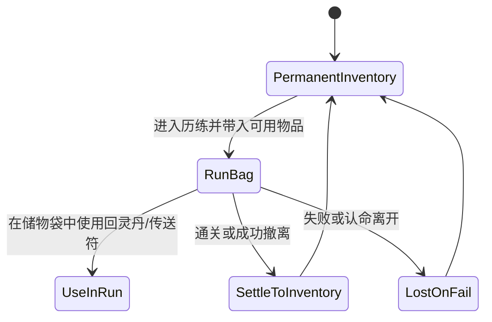
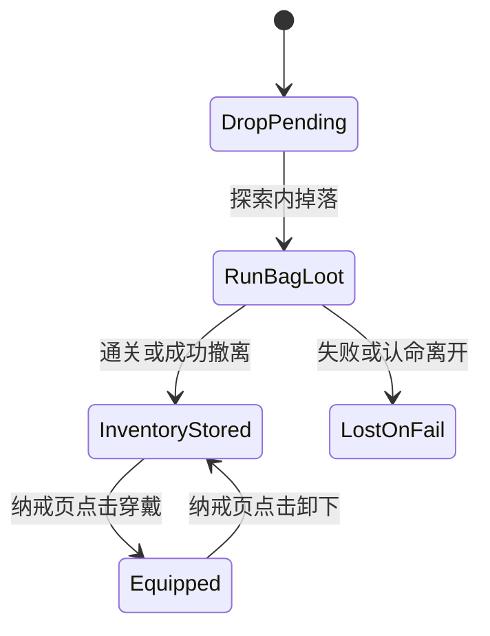

# 道具与装备轻实现级方案

## 1. 文档定位
本文档用于定义当前版本“道具系统 + 装备轻实现”的具体落地规则，避免实现线程把道具、装备、储物袋、纳戒与人物页各自拆成互不一致的独立逻辑。

当前版本定位：
- 道具系统：正式实现
- 装备系统：轻实现

本文档约束：
- 若与总 PRD 冲突，以 [当前产品需求.md](/Users/cuihua/Documents/git/minigame-1/product/产品需求/当前产品需求.md) 为产品方向真源。
- 若与运行时代码冲突，以本文档作为后续实现目标。

## 2. 功能目标
### 2.1 道具系统目标
让玩家在当前版本明确感知：
- 哪些物品属于永久库存
- 哪些物品属于本次历练临时资源
- 哪些物品能在探索中使用
- 哪些物品只在人物页/破境时自动消耗

### 2.2 装备系统目标
当前版本装备只承担“辅助成长”职责，不承担复杂构筑职责。

装备系统必须服务于：
- 探索掉落反馈
- 纳戒中的穿戴/卸下决策
- 人物页中的成长摘要

装备系统当前明确不承担：
- 品质随机
- 词条随机
- 强化、升星、洗炼
- 独立装备页养成循环

## 3. 数据真源
### 3.1 正式真源
- [道具配置总表.csv](/Users/cuihua/Documents/git/minigame-1/product/数值策划/道具配置总表.csv)
- [装备掉落配置总表.csv](/Users/cuihua/Documents/git/minigame-1/product/数值策划/装备掉落配置总表.csv)
- [关卡楼层脚本总表.csv](/Users/cuihua/Documents/git/minigame-1/product/数值策划/关卡楼层脚本总表.csv)
- [敌人配置总表.csv](/Users/cuihua/Documents/git/minigame-1/product/数值策划/敌人配置总表.csv)

### 3.2 数据职责划分
- `道具配置总表.csv`
  - 定义道具类型、展示入口、使用页面、效果类型、是否写入储物袋/纳戒
- `装备掉落配置总表.csv`
  - 定义装备在各关卡的掉落来源、权重与数量
- `关卡楼层脚本总表.csv`
  - 定义哪些楼层会进入掉落结算环节
- `敌人配置总表.csv`
  - 只决定敌人击败后触发战利品分发，不直接定义装备详情

### 3.3 禁止事项
- 不允许在代码中新增未登记于 `道具配置总表.csv` 的道具或装备。
- 不允许把装备属性写死在 UI 文案中，必须来自真源。
- 不允许让材料、突破材料在探索中直接使用。

## 4. 物品分类规则
### 4.1 当前版本正式道具分类
1. 可在探索中主动使用
- 回灵丹
- 传送符

2. 只能在破境流程中自动消耗
- 各境界突破丹

3. 只能作为库存展示与结算材料
- 普通材料
- 突破材料

4. 轻实现装备
- 武器
- 戒指
- 法袍

### 4.2 页面入口映射
| 物品类型 | 人物页 | 纳戒页 | 储物袋页 | 探索页本体 | 破境确认层 |
| --- | --- | --- | --- | --- | --- |
| 回灵丹 | 否 | 是 | 是 | 否 | 否 |
| 传送符 | 否 | 是 | 是 | 否 | 否 |
| 普通材料 | 否 | 是 | 是 | 否 | 否 |
| 突破材料 | 否 | 是 | 否 | 否 | 是 |
| 突破丹 | 否 | 是 | 否 | 否 | 是 |
| 装备 | 人物摘要 | 是 | 否 | 否 | 否 |

## 5. 道具使用状态机

### 5.1 回灵丹
- 来源：纳戒携带 / 历练掉落
- 可使用页面：储物袋页
- 使用效果：恢复当前最大气血 30%
- 使用后写回：
  - 若来源于纳戒携带，则扣减永久库存
  - 若来源于本次历练掉落，则扣减储物袋本次数量

### 5.2 传送符
- 来源：纳戒携带 / 事件掉落
- 可使用页面：储物袋页
- 使用效果：立即安全撤离并保留战利品
- 使用后写回：
  - 触发撤离成功结算
  - 本次储物袋战利品写回纳戒

### 5.3 突破丹
- 来源：掉落 / 成就奖励 / 其他正式奖励
- 使用页面：不可手点使用
- 触发位置：人物页破境确认层
- 使用方式：满足突破条件并点击确认后自动消耗 1 个

## 6. 装备轻实现状态机

## 7. 纳戒页实现规范
### 7.1 页面职责
纳戒页只负责：
- 展示永久库存
- 使用可永久操作的道具
- 穿戴/卸下装备

### 7.2 纳戒页必须展示
1. 页面标题
- `纳戒`

2. 左上返回
- 返回人物页

3. 分类内容
- 丹药
- 装备
- 材料

4. 每项字段
- 名称
- 数量（若适用）
- 简要用途或当前状态

### 7.3 纳戒页禁止展示
- 0 数量项
- 当前历练临时储物袋战利品
- 探索内按钮
- 关卡中才能使用的即时操作按钮

### 7.4 纳戒页交互
1. 点击回灵丹
- 打开小弹层
- 仅显示用途说明与当前数量
- 若当前不在探索中，不提供直接使用

2. 点击突破丹
- 打开说明层
- 仅显示“用于破境时自动消耗”
- 不提供手动使用按钮

3. 点击装备
- 打开装备详情层
- 显示：
  - 装备名称
  - 部位
  - 当前加成
  - 当前状态（已穿戴 / 未穿戴）
- 操作：
  - 未穿戴 -> `穿戴`
  - 已穿戴 -> `卸下`

## 8. 储物袋页实现规范
### 8.1 页面职责
储物袋页只负责：
- 展示本次历练内可见物资
- 使用本次历练中允许使用的消耗品
- 显示本次关卡战利品

### 8.2 储物袋页必须展示
- 回灵丹（若数量 > 0）
- 传送符（若数量 > 0）
- 当前关卡灵石
- 当前关卡材料
- 当前关卡装备掉落

### 8.3 储物袋页禁止展示
- 0 数量项
- 穿戴/卸下装备操作
- 突破丹
- 已归档到纳戒的永久库存总览

### 8.4 储物袋页交互
1. 点击回灵丹
- 立即使用并刷新当前气血

2. 点击传送符
- 弹出确认层：
  - 标题：`是否撤离`
  - 文案：`使用传送符可立即撤离，并带回本次战利品。`
- 确认后执行安全撤离

3. 点击装备掉落
- 只显示预览说明：
  - `通关或成功撤离后将收入纳戒`
- 不允许在储物袋页提前穿戴

## 9. 人物页装备摘要规范
### 9.1 当前版本只允许展示摘要
人物页只显示：
- 武器：名称 / 无
- 戒指：名称 / 无
- 法袍：名称 / 无

### 9.2 禁止事项
- 不在人物页展开装备详情列表
- 不在人物页做穿戴/卸下操作
- 不在人物页展示复杂战力拆解

## 10. 掉落与写回规则
### 10.1 掉落来源
- 普通怪 / 小Boss / 大Boss 掉落由敌人结算触发
- 装备掉落权重只从 [装备掉落配置总表.csv](/Users/cuihua/Documents/git/minigame-1/product/数值策划/装备掉落配置总表.csv) 读取

### 10.2 写回规则
1. 历练中掉落
- 先进入 `runBag`

2. 成功撤离或通关
- `runBag` 内材料、灵石、装备写入 `inventory`
- `runBag` 清空

3. 失败或认命离开
- 当前战利品丢失
- 不写入纳戒
- `runBag` 清空

### 10.3 冲突约束
- 不允许出现“装备已在储物袋中又同时穿戴生效”的双重状态
- 不允许突破丹进入储物袋
- 不允许材料在探索中被消费

## 11. 依赖关系
1. 依赖 [轻肉鸽战斗边界状态机与写回规则.md](/Users/cuihua/Documents/git/minigame-1/product/实现规范/轻肉鸽战斗边界状态机与写回规则.md)
- 决定储物袋页何时出现、何时写回

2. 依赖 [人物页与洞府中枢实现级方案.md](/Users/cuihua/Documents/git/minigame-1/product/实现规范/人物页与洞府中枢实现级方案.md)
- 决定人物页装备摘要与破境入口关系

3. 依赖 [破境与渡劫实现级方案.md](/Users/cuihua/Documents/git/minigame-1/product/实现规范/破境与渡劫实现级方案.md)
- 决定突破丹自动消耗逻辑

## 12. 微信开发者工具验收
### 12.1 必测项
- 道具 0 数量不显示
- 回灵丹只能在储物袋中直接使用
- 传送符使用后触发安全撤离并写回纳戒
- 装备掉落先进入储物袋，不可直接穿戴
- 成功撤离后装备进入纳戒
- 失败离开后装备不进入纳戒
- 纳戒页可穿戴 / 卸下装备
- 人物页装备摘要与纳戒穿戴结果一致
- 突破丹不进入储物袋，只在破境时自动消耗

### 12.2 Smoke Case
- `WT-21`：探索掉落回灵丹，储物袋使用后气血恢复
- `WT-22`：探索掉落装备，成功撤离后纳戒可见
- `WT-23`：探索掉落装备，失败离开后纳戒不可见
- `WT-24`：纳戒穿戴装备后，人物页摘要同步变化
- `WT-25`：破境时只从纳戒扣除突破丹

## 13. 结论
当前版本的道具与装备系统必须保持“简单、稳定、可解释”。

重点不是扩装备深度，而是保证：
- 玩家知道什么东西属于本次历练
- 玩家知道什么东西属于永久库存
- 玩家不会在不同页面看到互相冲突的使用规则
